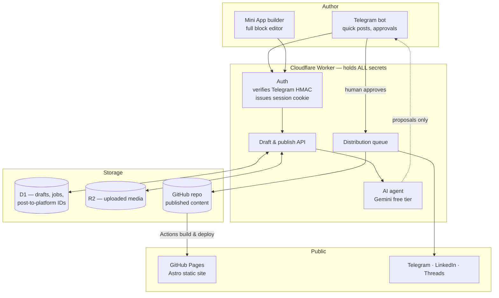
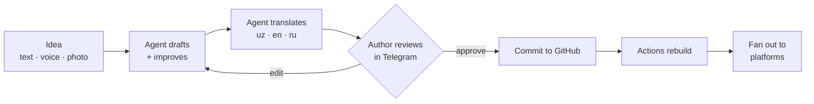
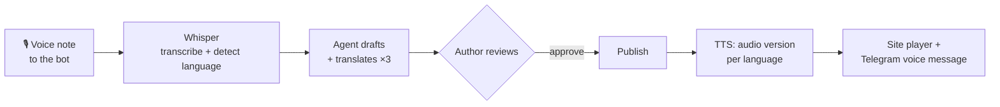

# muhammadjon.me — Architecture v2

**Status:** Design approved, not yet built
**Author:** Muhammadjon Ibrohimov, with Claude
**Date:** 2026-08-09

---

## 1. What this has to do

Decisions from the requirements interview. These are settled — treat them as constraints, not suggestions.

| # | Decision | Rationale |
|---|---|---|
| D1 | Posts are **fully public**. No reader gate. | Portfolio needs SEO, link previews, sharing. |
| D2 | **Three languages**: Uzbek, English, Russian. | Local audience + international clients. |
| D3 | AI **translates, human approves**. Write once. | Three languages without three times the work. |
| D4 | Publishing via **Telegram bot + Mini App builder**. | Works from any device with zero setup. |
| D5 | **AI agent** improves drafts, reads images/video, cross-posts. | Author acts as editor, not typist. |
| D6 | Agent **always shows work before publishing**. Nothing autonomous. | An AI mistake goes out under a real name. |
| D7 | Distribute to **Telegram, LinkedIn, Threads**. | X excluded: no free tier, and no account. |
| D8 | Build it **properly**, not as a prototype. | Grow into it instead of rebuilding. |
| D9 | Dynamic UI, **all four 2026 directions**, zoned (§7). | Author's call; zoning keeps it coherent. |
| **D10** | **Zero recurring cost. Free tiers only.** | Hard constraint. Overrides every other preference. |
| **D11** | **The LLM must be multimodal** — image, video, audio, PDF in. | D5 requires reading media, not just text. A text-only model cannot do the job. |
| **D12** | **A fallback provider is mandatory**, not optional. | Free tiers rate-limit and change terms. One provider is a single point of failure. |
| **D13** | Providers: **OpenRouter + Groq**. No Gemini, no Claude. | Author preference; both have genuine free tiers. See §10. |
| **D14** | **Voice is a first-class input and output**, not an add-on. | Speak a post from anywhere; listeners get audio in all three languages. See §5.1. |

**Three non-negotiables:** no secret ever reaches the browser (§4), nothing in this design costs money (§10), and the agent can read media with a fallback behind it (§10 ladder). Everything below follows from those.

---

## 2. Why v1 cannot deliver this

Not a code-quality problem. A structural one.

v1 is a static site with no server. Publishing needs a GitHub token, so the token has to live in `localStorage` — the only place a static site can keep it. That single fact causes every major problem:

- **"Any device" fails.** Each new device means pasting a repo-write token into a phone browser.
- **Telegram login can't be verified.** Verification needs an HMAC over a bot secret. Client-side that means shipping the bot token to the browser, so `login.html` skips verification when the token is absent — leaving only a client-controlled ID check.
- **Any XSS is total compromise.** Both tokens sit in reachable storage, and post content renders through `marked` unsanitized.
- **Three languages don't fit.** Browser-generated HTML per post × 3 languages × index pages is not maintainable by hand.

One change fixes all four: **a server that holds the secrets.** Everything else is downstream. Cloudflare Workers provides this inside its free tier.

---

## 3. Target architecture



### Layer responsibilities

**Content (GitHub repo)** — source of truth for anything published. Markdown + frontmatter, one file per language:
`src/content/posts/<slug>/{uz,en,ru}.md`. Git gives free version history and rollback.

**Site (Astro, built by GitHub Actions, served by GitHub Pages)** — static generation. Astro because it ships zero JS by default (which the scroll-driven motion in §7 depends on), has native i18n routing, and supports interactive islands for the Mini App builder. Staying on GitHub Pages keeps the working custom domain and avoids a DNS migration; Actions minutes are free on public repos.

**API (Cloudflare Worker)** — the only place secrets exist: GitHub token, Telegram bot token, Gemini key, LinkedIn/Threads tokens. Stored as Worker secrets, never in the repo, never sent to a client. The site calls it cross-origin with credentials; the Worker allows exactly one origin.

**Agent (multimodal LLM, called from the Worker)** — translation, draft improvement, reading images and video frames, alt text, per-platform variants.

Two hard requirements govern this layer:

- **Multimodal is mandatory (D11).** The model must accept image, video, audio and PDF input directly. D5 asks the agent to *understand* the media in a post — describe a screenshot, summarise a video, write alt text in three languages. A text-only model cannot do this, so text-only providers are disqualified as *primary* no matter how fast or free.
- **A fallback is mandatory (D12).** Never a single provider. The routing table and fallback order are defined in §10; selection happens behind one interface so no calling code knows which provider answered.

Providers are **OpenRouter and Groq** (D13). Groq additionally carries the voice layer — Whisper for speech-in, Orpheus for speech-out (§5.1).

Per D6 the agent **only ever writes to the drafts table.** It has no path to the publish endpoint — enforced structurally, not by prompting.

**Distribution** — after human approval, fans out to the platforms. Records each platform's message ID in D1 so later edits and deletes propagate instead of orphaning.

---

## 4. Auth — the piece that unlocks everything

```mermaid
sequenceDiagram
    participant P as Phone (any device)
    participant W as Worker
    participant T as Telegram

    P->>P: Open Mini App inside Telegram
    P->>W: POST /auth  { initData }
    W->>W: HMAC-SHA256(initData, botToken)
    Note over W: Bot token never leaves the Worker
    W->>W: Check signature, auth_date age, allowed user ID
    W-->>P: Set-Cookie: session=<signed JWT><br/>HttpOnly; Secure; SameSite=None
    P->>W: Subsequent calls carry the cookie
    W->>T: Publish on the author's behalf
```

Properties this buys:

- Signature verified **server-side with the real secret** — actual authentication, not a client-side ID comparison.
- The browser holds **only a signed session cookie**. Nothing else. A stolen laptop leaks nothing.
- **Any device works instantly.** Open Telegram, tap the bot. No token pasting, ever.
- `HttpOnly` means even a successful XSS cannot read the session.
- Sessions are revocable server-side. v1 had no revocation at all.

Browser (non-Telegram) access uses the Telegram Login Widget against the same verification endpoint.

---

## 5. Publishing pipeline



**Two entry points, one pipeline.**

- *Quick post* — message the bot. Agent drafts, translates, replies with a preview and inline Approve / Edit / Discard buttons.
- *Full post* — open the Mini App. The v1 block editor, rebuilt as an Astro island: same blocks, same live preview, but talking to the Worker instead of holding a GitHub token.

**Approval gate (D6).** The agent writes proposals to D1 and stops. Only an authenticated human hitting `POST /publish` moves content to GitHub or social. There is no code path from agent output to publication. Prompting is not a security boundary; the missing endpoint is.

**Media.** Uploads go to R2, not external hotlinks. The agent generates alt text in all three languages from the image itself — an accessibility win that also feeds SEO.

**Cross-platform variants.** One post, several shapes: Telegram keeps the full caption, LinkedIn gets a professional framing, Threads gets a conversational cut. The agent proposes each; the author approves each.

### 5.1 Voice (D14)

Voice is treated as a first-class input *and* output, not a bolt-on. It is also the purest expression of "publish from anywhere" — speaking needs no keyboard, no screen, and no good connection.



**Four capabilities:**

1. **Speak a post.** Send a voice note in Uzbek, English or Russian. Whisper transcribes it, detects the language automatically, and the agent shapes it into a draft and translates it into the other two. Walking, driving, no laptop — the post still gets written.

2. **Listen to any post.** Every published post gets a generated audio version in each language, exposed as a small player on the site and pushed to the Telegram channel as a native voice message. Real accessibility, and it meets an audience that would rather listen than read.

3. **Voice commands.** Short spoken instructions to the bot — *"publish the draft"*, *"make it shorter"*, *"translate to Russian only"*. Transcribed, matched to an intent, and — per D6 — **still surfaced for confirmation before anything is published.** Voice does not bypass the approval gate.

4. **Auto-transcribe uploaded media.** Video or audio attached to a post gets transcribed for captions, on-page text, and search. One Whisper call turns an opaque media file into indexable, accessible content.

**Cost:** Groq's free Whisper allowance is 28,800 audio-seconds/day — **eight hours of transcription daily.** Realistic use is minutes. This is comfortably free.

**Honest caveats:**

- **Uzbek accuracy is the weak point.** Whisper is markedly stronger in English and Russian than in Uzbek, and TTS voice quality for Uzbek is worse still. Always show the transcript for correction before drafting, and never publish a voice transcript unreviewed.
- **TTS is Preview.** Groq's Orpheus models can change or disappear. Audio is best-effort: the site must be perfect with no audio present, and Workers AI TTS stands behind it.
- **Voice notes are personal data.** Transcribe, use, discard. Do not archive raw audio in R2 beyond the draft's life.

---

## 6. Internationalisation

Routes: `/uz/...`, `/en/...`, `/ru/...`. Uzbek is the default; `/` redirects by `Accept-Language` with a manual override that sticks.

- **UI strings** live in `src/i18n/{uz,en,ru}.json`. Never hardcode display text.
- **Post content** is one Markdown file per language under a shared slug.
- **Slugs stay stable across languages** — one canonical slug, translated titles. Avoids v1's slug bug where non-ASCII titles collapsed into `post-<timestamp>`.
- **`hreflang`** tags on every page so Google serves the right language.
- **Per-language RSS**: `/uz/rss.xml`, `/en/rss.xml`, `/ru/rss.xml`.
- **Translation status** is tracked in frontmatter. A language missing a translation is hidden rather than shown broken or empty.

---

## 7. Design system & the dynamic UI

All four directions were requested (D9). Taken literally they conflict: liquid glass wants cool translucency, brutalism wants raw hard edges, and the existing palette is warm paper. **Resolution: each gets an exclusive zone.** One visual language per surface, never two competing on the same element.

| Zone | Direction | Applied to |
|---|---|---|
| Base | Warm paper — cream/clay carried over from v1 | Body, typography, reading surfaces |
| Motion | Scroll-driven reveals + kinetic variable type | Hero, section transitions, post entry |
| Depth | Liquid glass, **sparingly** | Sticky nav, modals, language switcher only |
| Structure | Tactile brutalism | Projects grid — hard borders, visible grid, high contrast |
| Behaviour | Adaptive ordering | Homepage section order by referrer |

**Adaptive ordering.** Arriving from LinkedIn surfaces projects first; from the Telegram channel, writing first; unknown referrer gets the balanced default. Implemented as a CSS class applied before first paint — no layout shift, no flash, works with JS disabled.

**Motion rules — non-negotiable:**

- CSS scroll-driven animations (`animation-timeline`), not JavaScript scroll listeners.
- `prefers-reduced-motion: reduce` disables all non-essential motion. 2026 accessibility baseline, and the right call regardless.
- Motion never gates content. Everything readable with JS off.
- Variable font axes drive kinetic type — one font file, no extra weight.

**Design tokens live in exactly one place.** v1 duplicated the same CSS variables across seven files and the theme toggle across six, which is why it became painful to change. One token file. One theme script, inline in `<head>` to kill the dark-mode flash v1 has on every page.

---

## 8. Repo layout

```
src/
  content/posts/<slug>/{uz,en,ru}.md   # published content, git-versioned
  components/                          # Astro components
  layouts/
  styles/tokens.css                    # single source of design truth
  i18n/{uz,en,ru}.json                 # UI strings
  islands/PostBuilder/                 # Mini App editor
  pages/[lang]/                        # localised routes
worker/
  src/{auth,drafts,publish,agent,distribute}.ts
  wrangler.toml                        # secrets by reference only, never values
.github/workflows/deploy.yml           # Astro build → Pages
public/
ARCHITECTURE.md                        # this file
```

---

## 9. Migration plan

Ordered so the site keeps working throughout. Nothing here breaks publishing before its replacement exists.

**Phase 0 — stop the bleeding — ✅ DONE**
- Removed the reader gate that made every new post unreadable.
- Deleted the dead `reader-login.html` and the 892 KB unreferenced favicon.

**Phase 1 — reach — ✅ DONE** *(no new infrastructure)*
- Open Graph + Twitter cards, `sitemap.xml`, `robots.txt`, `404.html`, RSS, JSON-LD — all live.
- LinkedIn app review **not yet started** — still the long pole before Phase 5 can fan out there.

**Phase 2 — the Worker — ✅ DONE** *(the unlock)*
- `worker/` deployed at `https://miuceo-worker.ibrokhimovmiu.workers.dev`. Real Telegram HMAC verification (both Login Widget and Mini App constructions), D1-backed revocable sessions, session cookie auth.
- `login.html` / `admin.html` / `post-builder.html` cut over — no GitHub PAT or Telegram bot token in the browser anymore. Live-tested end to end: login, create, edit, delete all confirmed working on `muhammadjon.me`.
- Bot switched mid-project to `@muhammadjon_me_bot`; the old `@miuceo_pws_bot` message IDs on existing posts can't be edited by the new bot (Telegram restriction) — `post-builder.html` now falls back to sending a fresh message when an edit fails, so this self-heals per post on its next save.
- The pre-Worker GitHub PAT that lived in `localStorage` has been **revoked** (2026-08-10). Phase 2 is fully closed.

**Phase 3 — Astro rebuild — ⚠️ PARTIAL, AND DIVERGED FROM THE ORIGINAL PLAN**
- Done: single-source design tokens (`assets/theme.css`, `assets/theme.js`) replacing the old 7-file duplication — this was a Phase 3 goal, delivered early, directly on v1 HTML.
- **Not done:** the actual Astro migration, component system, trilingual routing, per-language feeds.
- **Design direction changed.** §7 above still describes the original plan (warm paper base + zoned liquid-glass/brutalism/scroll-motion). What actually shipped is a full pivot: JetBrains Mono everywhere, near-black terminal palette, neon green/cyan glow, applied directly to v1 pages — not the zoned system, not built in Astro. A code-window with a 5-language (JS/Python/Go/Java/Rust) typewriter effect sits in the homepage hero. §7 needs a rewrite to match reality before starting Astro work, or the two will keep contradicting each other.
- Still open: trilingual (uz/en/ru) routing hasn't started — the site is Uzbek-only today, same as v1.

**Phase 4 — Mini App — ❌ NOT STARTED**
- Rebuild the block editor as an island against the Worker API.

**Phase 5 — agent, voice & distribution — ❌ NOT STARTED**
- No AI agent exists yet. Posts publish exactly as typed, no translation, no improvement pass.
- OpenRouter + Groq behind the single agent interface: translation, improvement, media understanding.
- Voice in (Whisper) before voice out (TTS) — speaking a post is the higher-value half, and does not depend on Preview-status models.
- Approval flow in Telegram, then platform fan-out one channel at a time — Telegram first (already working, manual only), LinkedIn next (blocked on the Phase 1 app review above).

---

## 10. Cost — the D10 audit

Every component, checked against its free tier. **Total recurring cost: $0.**

| Component | Free allowance | Fits? |
|---|---|---|
| GitHub Pages + Actions | Unlimited on public repos | ✅ |
| Cloudflare Workers | 100k requests/day | ✅ Vastly over-provisioned |
| Cloudflare D1 | 5 GB storage, 5M reads/day | ✅ |
| Cloudflare R2 | 10 GB storage, **zero egress fees** | ✅ Egress-free is the key part |
| OpenRouter | `:free` models, 20 req/min | ✅ Primary reasoning + full multimodal |
| Groq | No card, perpetual free within rate limits | ✅ Voice + fast text + vision |
| Workers AI (last resort) | 10,000 neurons/day ≈ 1,300 responses | ✅ |
| Telegram Bot API | Unlimited | ✅ |
| LinkedIn API | Free; needs app review | ✅ Time cost, not money |
| Threads API | Free; needs linked Business account | ✅ |
| ~~X / Twitter~~ | No free tier since 6 Feb 2026 | ❌ **Excluded entirely** |

**On X.** Excluded for two independent reasons: as of 6 February 2026 X removed the free tier for new developers and moved to pay-per-use (~$0.015 per post, rising to **$0.20 for a post containing a URL** — and every blog announcement contains one), and the author has no X account. Not built, not stubbed, not mentioned in the UI. If an account ever appears, it slots into the same distribution interface as the other platforms.

### AI provider ladder

The agent layer is deliberately isolated behind **one interface** in `worker/src/agent.ts`. Swapping provider is a single-file change, never a rewrite. Providers are tried in order:

Per D13 the providers are **OpenRouter and Groq**. Routed by task, not by a single global default:

| Task | Provider & model | Free allowance | Why |
|---|---|---|---|
| **Multimodal reasoning** (image, video, audio, PDF) | OpenRouter — `nvidia/nemotron-3-nano-omni-30b-a3b-reasoning:free` | 20 req/min | Accepts text, image, video **and** audio in one inference loop, 256K context. Satisfies D11 outright. |
| **Image-only** understanding | OpenRouter — `google/gemma-4-31b-it:free` | 20 req/min | Cheaper and stronger for plain vision-language work. |
| **Speech → text** | Groq — `whisper-large-v3` | 20 RPM · 2,000/day · **28,800 audio-seconds/day** (8 h) | Best free STT available. 25 MB max per file. |
| **Text → speech** | Groq — Orpheus TTS *(Preview)* | ~100 chars/sec | Fast enough for near-real-time. Preview status — see risks. |
| **Fast text** (translation, rewriting) | Groq — Llama 4 Scout | 30 RPM · up to 14,400/day | Lowest latency; the bulk of routine work lands here. |
| **Last resort** | Cloudflare Workers AI | 10,000 neurons/day | Already inside the Worker — no extra key, no network hop. |

**Fallback order for any task:** OpenRouter → Groq → Workers AI → queue and retry. Never fail silently; never lose a draft.

**Three caveats worth designing around:**

1. **OpenRouter's daily cap is 50 requests/day** unless $10 of credit has been purchased *once ever*, which raises it to 1,000/day. Under D10 assume the 50/day tier. A full post costs roughly 5 calls, so that is ~10 posts/day — sufficient, but the Worker must count and degrade to Groq before hitting the wall.
2. **The free model roster rotates.** Model IDs above were accurate in August 2026 and *will* change. Never hardcode a model ID in feature code — keep the list in Worker config with a health check that drops a model on repeated failure.
3. **Groq TTS is Preview status.** Treat audio output as best-effort; the site must render perfectly with no audio version present.

Gemini and Claude are excluded by D13 — Gemini by preference, Claude because it has no free tier. The single-file interface in `worker/src/agent.ts` means either could be reinstated as a config change if that ever changes.

**Design rule:** never let a provider outage or a hit rate-limit lose a draft. Drafts land in D1 *before* the agent is called, so failure degrades to "translation pending", never to lost work.

**Risks worth tracking:**

- *LinkedIn app review* has the longest lead time and gates the most valuable channel. Start it in Phase 1, not Phase 5.
- *Free-tier limits* are per-day and providers change terms without notice. This is exactly why D12 makes a fallback mandatory: on rate-limit or outage the ladder steps down automatically, and the draft is already safe in D1. Multimodal work waits for a multimodal provider rather than silently degrading to a text-only one that would invent image descriptions.
- *Scope.* Phases 1–2 deliver most of the real value. Phases 4–5 are the ambitious part; ship 1–3 before judging them.
- *Translation quality.* Uzbek is lower-resource than English or Russian. Review Uzbek output more carefully at first and keep D6's approval gate strict.
- *Token rotation* in Phase 2 is not optional. The current tokens have been sitting in browser storage.

---

## 11. Open decisions

Not blocking Phases 0–2. Decide before Phase 3.

1. **Comments** — none, or Giscus on GitHub Discussions (free)?
2. **Analytics** — Cloudflare Web Analytics (free, privacy-preserving) or nothing?
3. **Projects data** — hand-written, or pulled live from the GitHub API?
4. **Newsletter** — email capture, or is the Telegram channel enough?
5. **Worker domain** — `*.workers.dev` (free, needs CORS) or `api.muhammadjon.me` (free, but requires DNS on Cloudflare)?
