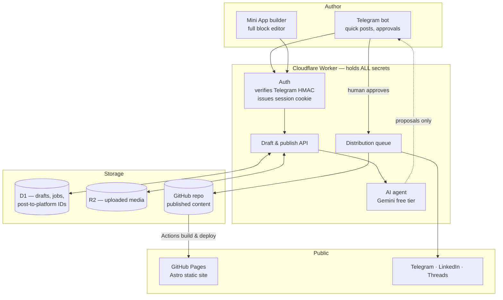
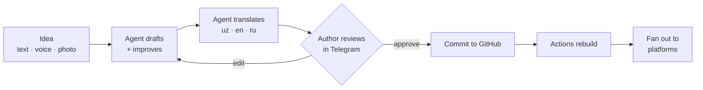
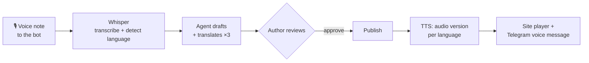

# muhammadjon.me — Architecture v2

**Status:** Design approved, not yet built
**Author:** Muhammadjon Ibrohimov, with Claude
**Date:** 2026-08-09

---

## 1. What this has to do

Decisions from the requirements interview. These are settled — treat them as constraints, not suggestions.

| # | Decision | Rationale |
|---|---|---|
| D1 | Posts are **fully public**. No reader gate. | Portfolio needs SEO, link previews, sharing. |
| D2 | **Three languages**: Uzbek, English, Russian. | Local audience + international clients. |
| D3 | AI **translates, human approves**. Write once. | Three languages without three times the work. |
| D4 | Publishing via **Telegram bot + Mini App builder**. | Works from any device with zero setup. |
| D5 | **AI agent** improves drafts, reads images/video, cross-posts. | Author acts as editor, not typist. |
| D6 | Agent **always shows work before publishing**. Nothing autonomous. | An AI mistake goes out under a real name. |
| D7 | Distribute to **Telegram, LinkedIn, Threads**. | X excluded: no free tier, and no account. |
| D8 | Build it **properly**, not as a prototype. | Grow into it instead of rebuilding. |
| D9 | Dynamic UI, **all four 2026 directions**, zoned (§7). | Author's call; zoning keeps it coherent. |
| **D10** | **Zero recurring cost. Free tiers only.** | Hard constraint. Overrides every other preference. |
| **D11** | **The LLM must be multimodal** — image, video, audio, PDF in. | D5 requires reading media, not just text. A text-only model cannot do the job. |
| **D12** | **A fallback provider is mandatory**, not optional. | Free tiers rate-limit and change terms. One provider is a single point of failure. |
| **D13** | Providers: **OpenRouter + Groq**. No Gemini, no Claude. | Author preference; both have genuine free tiers. See §10. |
| **D14** | **Voice is a first-class input and output**, not an add-on. | Speak a post from anywhere; listeners get audio in all three languages. See §5.1. |

**Three non-negotiables:** no secret ever reaches the browser (§4), nothing in this design costs money (§10), and the agent can read media with a fallback behind it (§10 ladder). Everything below follows from those.

---

## 2. Why v1 cannot deliver this

Not a code-quality problem. A structural one.

v1 is a static site with no server. Publishing needs a GitHub token, so the token has to live in `localStorage` — the only place a static site can keep it. That single fact causes every major problem:

- **"Any device" fails.** Each new device means pasting a repo-write token into a phone browser.
- **Telegram login can't be verified.** Verification needs an HMAC over a bot secret. Client-side that means shipping the bot token to the browser, so `login.html` skips verification when the token is absent — leaving only a client-controlled ID check.
- **Any XSS is total compromise.** Both tokens sit in reachable storage, and post content renders through `marked` unsanitized.
- **Three languages don't fit.** Browser-generated HTML per post × 3 languages × index pages is not maintainable by hand.

One change fixes all four: **a server that holds the secrets.** Everything else is downstream. Cloudflare Workers provides this inside its free tier.

---

## 3. Target architecture



### Layer responsibilities

**Content (GitHub repo)** — source of truth for anything published. Markdown + frontmatter, one file per language:
`src/content/posts/<slug>/{uz,en,ru}.md`. Git gives free version history and rollback.

**Site (Astro, built by GitHub Actions, served by GitHub Pages)** — static generation. Astro because it ships zero JS by default (which the scroll-driven motion in §7 depends on), has native i18n routing, and supports interactive islands for the Mini App builder. Staying on GitHub Pages keeps the working custom domain and avoids a DNS migration; Actions minutes are free on public repos.

**API (Cloudflare Worker)** — the only place secrets exist: GitHub token, Telegram bot token, Gemini key, LinkedIn/Threads tokens. Stored as Worker secrets, never in the repo, never sent to a client. The site calls it cross-origin with credentials; the Worker allows exactly one origin.

**Agent (multimodal LLM, called from the Worker)** — translation, draft improvement, reading images and video frames, alt text, per-platform variants.

Two hard requirements govern this layer:

- **Multimodal is mandatory (D11).** The model must accept image, video, audio and PDF input directly. D5 asks the agent to *understand* the media in a post — describe a screenshot, summarise a video, write alt text in three languages. A text-only model cannot do this, so text-only providers are disqualified as *primary* no matter how fast or free.
- **A fallback is mandatory (D12).** Never a single provider. The routing table and fallback order are defined in §10; selection happens behind one interface so no calling code knows which provider answered.

Providers are **OpenRouter and Groq** (D13). Groq additionally carries the voice layer — Whisper for speech-in, Orpheus for speech-out (§5.1).

Per D6 the agent **only ever writes to the drafts table.** It has no path to the publish endpoint — enforced structurally, not by prompting.

**Distribution** — after human approval, fans out to the platforms. Records each platform's message ID in D1 so later edits and deletes propagate instead of orphaning.

---

## 4. Auth — the piece that unlocks everything

```mermaid
sequenceDiagram
    participant P as Phone (any device)
    participant W as Worker
    participant T as Telegram

    P->>P: Open Mini App inside Telegram
    P->>W: POST /auth  { initData }
    W->>W: HMAC-SHA256(initData, botToken)
    Note over W: Bot token never leaves the Worker
    W->>W: Check signature, auth_date age, allowed user ID
    W-->>P: Set-Cookie: session=<signed JWT><br/>HttpOnly; Secure; SameSite=None
    P->>W: Subsequent calls carry the cookie
    W->>T: Publish on the author's behalf
```

Properties this buys:

- Signature verified **server-side with the real secret** — actual authentication, not a client-side ID comparison.
- The browser holds **only a signed session cookie**. Nothing else. A stolen laptop leaks nothing.
- **Any device works instantly.** Open Telegram, tap the bot. No token pasting, ever.
- `HttpOnly` means even a successful XSS cannot read the session.
- Sessions are revocable server-side. v1 had no revocation at all.

Browser (non-Telegram) access uses the Telegram Login Widget against the same verification endpoint.

---

## 5. Publishing pipeline



**Two entry points, one pipeline.**

- *Quick post* — message the bot. Agent drafts, translates, replies with a preview and inline Approve / Edit / Discard buttons.
- *Full post* — open the Mini App. The v1 block editor, rebuilt as an Astro island: same blocks, same live preview, but talking to the Worker instead of holding a GitHub token.

**Approval gate (D6).** The agent writes proposals to D1 and stops. Only an authenticated human hitting `POST /publish` moves content to GitHub or social. There is no code path from agent output to publication. Prompting is not a security boundary; the missing endpoint is.

**Media.** Uploads go to R2, not external hotlinks. The agent generates alt text in all three languages from the image itself — an accessibility win that also feeds SEO.

**Cross-platform variants.** One post, several shapes: Telegram keeps the full caption, LinkedIn gets a professional framing, Threads gets a conversational cut. The agent proposes each; the author approves each.

### 5.1 Voice (D14)

Voice is treated as a first-class input *and* output, not a bolt-on. It is also the purest expression of "publish from anywhere" — speaking needs no keyboard, no screen, and no good connection.



**Four capabilities:**

1. **Speak a post.** Send a voice note in Uzbek, English or Russian. Whisper transcribes it, detects the language automatically, and the agent shapes it into a draft and translates it into the other two. Walking, driving, no laptop — the post still gets written.

2. **Listen to any post.** Every published post gets a generated audio version in each language, exposed as a small player on the site and pushed to the Telegram channel as a native voice message. Real accessibility, and it meets an audience that would rather listen than read.

3. **Voice commands.** Short spoken instructions to the bot — *"publish the draft"*, *"make it shorter"*, *"translate to Russian only"*. Transcribed, matched to an intent, and — per D6 — **still surfaced for confirmation before anything is published.** Voice does not bypass the approval gate.

4. **Auto-transcribe uploaded media.** Video or audio attached to a post gets transcribed for captions, on-page text, and search. One Whisper call turns an opaque media file into indexable, accessible content.

**Cost:** Groq's free Whisper allowance is 28,800 audio-seconds/day — **eight hours of transcription daily.** Realistic use is minutes. This is comfortably free.

**Honest caveats:**

- **Uzbek accuracy is the weak point.** Whisper is markedly stronger in English and Russian than in Uzbek, and TTS voice quality for Uzbek is worse still. Always show the transcript for correction before drafting, and never publish a voice transcript unreviewed.
- **TTS is Preview.** Groq's Orpheus models can change or disappear. Audio is best-effort: the site must be perfect with no audio present, and Workers AI TTS stands behind it.
- **Voice notes are personal data.** Transcribe, use, discard. Do not archive raw audio in R2 beyond the draft's life.

---

## 6. Internationalisation

Routes: `/uz/...`, `/en/...`, `/ru/...`. Uzbek is the default; `/` redirects by `Accept-Language` with a manual override that sticks.

- **UI strings** live in `src/i18n/{uz,en,ru}.json`. Never hardcode display text.
- **Post content** is one Markdown file per language under a shared slug.
- **Slugs stay stable across languages** — one canonical slug, translated titles. Avoids v1's slug bug where non-ASCII titles collapsed into `post-<timestamp>`.
- **`hreflang`** tags on every page so Google serves the right language.
- **Per-language RSS**: `/uz/rss.xml`, `/en/rss.xml`, `/ru/rss.xml`.
- **Translation status** is tracked in frontmatter. A language missing a translation is hidden rather than shown broken or empty.

---

## 7. Design system & the dynamic UI

**This section describes what actually shipped, not the original D9 plan.** The original design (below, for the record) called for four zoned directions — warm paper base, scroll-driven motion, liquid glass sparingly, tactile brutalism on the projects grid. Mid-Phase-3 the author pivoted the whole site to a single unified terminal aesthetic instead, applied directly to v1 HTML pages. That is what is live today, so it is now the source of truth. Astro work should build *this* system, not the zoned one.

### 7.1 What's live

One visual language, everywhere — no zoning:

| Element | Treatment |
|---|---|
| Typography | JetBrains Mono (`--mono`) for everything, including headings — no serif/sans split |
| Palette (dark, default) | Near-black terminal (`--bg:#0B0E0D`), neon green/cyan/pink accents (`--neon-green:#3DFFA2`, `--neon-cyan:#38E8FF`, `--neon-pink:#FF3EC9`) |
| Palette (light) | Same tokens, inverted to paper-and-ink with the neons darkened for contrast (`[data-theme="light"]` in `assets/theme.css`) |
| Background texture | Faint 28px grid of hairlines (`--line-soft`) behind every page |
| Emphasis | Text-shadow glow (`.glow`, `.glow-cyan`) and glowing borders on hover, not depth/blur — no liquid-glass translucency anywhere |
| Homepage hero | A `.code-window` with a tabbed, typewriter-animated code snippet cycling through JS/Python/Go/Java/Rust, framed as a `whoami` terminal prompt |
| Cards & grids (e.g. `projects.html`) | Rounded 4–8px corners, 1px `--line` borders, neon-glow on hover — same language as buttons and nav, not a separate brutalist zone |
| Buttons | `.btn` outline-fills to neon-green with glow on hover; `.btn.ghost` and `.btn.danger` variants |

**Design tokens live in exactly one place** — `assets/theme.css` — replacing v1's seven-file duplication. Theme toggle logic is centralized in `assets/theme.js`, driven by a `data-theme` attribute and persisted to `localStorage`. This consolidation happened directly on v1 HTML, ahead of the Astro migration, and should carry forward unchanged into `src/styles/tokens.css`.

**Not carried over from the original plan:** adaptive homepage ordering by referrer, scroll-driven `animation-timeline` reveals, kinetic variable-font type, and zoned liquid-glass/brutalism. None of these are built. If the author wants them, they should be scoped as new work against the terminal system above, not resurrected from the D9 zoning.

**Motion rules — still non-negotiable if/when motion is added:**

- CSS scroll-driven animations (`animation-timeline`), not JavaScript scroll listeners.
- `prefers-reduced-motion: reduce` disables all non-essential motion — already respected in `assets/theme.css`.
- Motion never gates content. Everything readable with JS off.

### 7.2 Original plan (superseded, kept for history)

D9 asked for all four 2026 directions at once. Taken literally they conflict: liquid glass wants cool translucency, brutalism wants raw hard edges, and the original palette was warm paper. The resolution on paper was to zone them — one direction per surface:

| Zone | Direction | Applied to |
|---|---|---|
| Base | Warm paper — cream/clay carried over from v1 | Body, typography, reading surfaces |
| Motion | Scroll-driven reveals + kinetic variable type | Hero, section transitions, post entry |
| Depth | Liquid glass, sparingly | Sticky nav, modals, language switcher only |
| Structure | Tactile brutalism | Projects grid — hard borders, visible grid, high contrast |
| Behaviour | Adaptive ordering | Homepage section order by referrer |

This was never built — the terminal pivot in §7.1 replaced it before implementation started.

---

## 8. Repo layout

```
src/
  content/posts/<slug>/{uz,en,ru}.md   # published content, git-versioned
  components/                          # Astro components
  layouts/
  styles/tokens.css                    # single source of design truth
  i18n/{uz,en,ru}.json                 # UI strings
  islands/PostBuilder/                 # Mini App editor
  pages/[lang]/                        # localised routes
worker/
  src/{auth,drafts,publish,agent,distribute}.ts
  wrangler.toml                        # secrets by reference only, never values
.github/workflows/deploy.yml           # Astro build → Pages
public/
ARCHITECTURE.md                        # this file
```

---

## 9. Migration plan

Ordered so the site keeps working throughout. Nothing here breaks publishing before its replacement exists.

**Phase 0 — stop the bleeding — ✅ DONE**
- Removed the reader gate that made every new post unreadable.
- Deleted the dead `reader-login.html` and the 892 KB unreferenced favicon.

**Phase 1 — reach — ✅ DONE** *(no new infrastructure)*
- Open Graph + Twitter cards, `sitemap.xml`, `robots.txt`, `404.html`, RSS, JSON-LD — all live.
- LinkedIn app review **not yet started** — still the long pole before Phase 5 can fan out there.

**Phase 2 — the Worker — ✅ DONE** *(the unlock)*
- `worker/` deployed at `https://miuceo-worker.ibrokhimovmiu.workers.dev`. Real Telegram HMAC verification (both Login Widget and Mini App constructions), D1-backed revocable sessions, session cookie auth.
- `login.html` / `admin.html` / `post-builder.html` cut over — no GitHub PAT or Telegram bot token in the browser anymore. Live-tested end to end: login, create, edit, delete all confirmed working on `muhammadjon.me`.
- Bot switched mid-project to `@muhammadjon_me_bot`; the old `@miuceo_pws_bot` message IDs on existing posts can't be edited by the new bot (Telegram restriction) — `post-builder.html` now falls back to sending a fresh message when an edit fails, so this self-heals per post on its next save.
- The pre-Worker GitHub PAT that lived in `localStorage` has been **revoked** (2026-08-10). Phase 2 is fully closed.

**Phase 3 — Astro rebuild — ⚠️ MOSTLY DONE, NOT YET LIVE**
- Done (2026-08-10): the Astro site is fully built — new `package.json`/`astro.config.mjs` at repo root, `src/` with content collections (`posts`, `projects`), `src/i18n/{uz,en,ru}.json` (hand-translated UI strings), trilingual routing (`/uz/`, `/en/`, `/ru/` for home/posts/projects/contact), per-language `rss.xml`, `@astrojs/sitemap`-generated `sitemap.xml` with `hreflang` alternates, `public/robots.txt`, and a first-ever `.github/workflows/deploy.yml` (build-and-artifact on every push; the `deploy` job only runs on manual `workflow_dispatch`, and even then only takes effect once Pages' source is switched — see below).
- Design tokens ported to `src/styles/tokens.css`, matching `assets/theme.css` (§7's shipped terminal aesthetic — JetBrains Mono, near-black + neon green/cyan/pink). Theme-toggle flash-prevention script is now inline in `<head>`, per §7's rule, an improvement over v1's external `<script src>`.
- `login.html`, `admin.html`, `post-builder.html` were copied byte-identical into `public/` (verified via `diff`) so they keep working against the Worker exactly as today once deployed — their publish pipeline was **not** touched.
- Existing content migrated once: the one live post and all seven `projects.html` cards now exist as Astro content collection entries (`src/content/posts/introducing-claude-sonnet-5/uz.md`, `src/content/projects/*.md`). English/Russian post translations don't exist yet (that's Phase 5's AI agent) — only the `uz` post page builds today, which is correct per §6 ("a language missing a translation is hidden rather than shown broken").
- Verified: `npm run build` succeeds, all 12 pages generate, sitemap/RSS validated, admin pages confirmed unchanged.
- **Dual-write shipped and confirmed working end-to-end in production (2026-08-10).** `post-builder.html` writes a mirrored `src/content/posts/<slug>/uz.md` (frontmatter + markdown body) alongside the old `posts/`, `posts-data/`, `posts.json` files on every publish, and `admin.html`'s delete flow removes it too. The Worker's `isAllowedPath()` allowlist (`worker/src/github.ts`) was extended to permit that path **and the author has deployed it** — a live re-save of the "Beyond the Single Discipline" post produced a real commit (`6e57698`) creating `src/content/posts/beyond-the-single-discipline.../uz.md`, which builds correctly through Astro's real content schema.
  - **Deliberately non-fatal.** Every v2 write/delete is wrapped so a failure there (403 from the Worker, network error, anything) logs a warning and lets the v1 publish/delete finish normally.
  - **Caught and fixed in the same session: GitHub Pages' Jekyll build was silently breaking on Astro syntax.** `hreflangPaths={{}}` (a normal empty-object Astro prop) in `post-builder.astro` was being parsed as Liquid template syntax by GitHub Pages' default Jekyll processing, failing the build and leaving the live site stuck serving a stale copy of `post-builder.html` for ~40 minutes after the Phase 3/4 push — invisible until a live publish test surfaced it. Fixed by adding `.nojekyll` at the repo root (standard practice once a repo has non-Jekyll framework source in it); confirmed via `curl` that the live file updated after the fix.
- **✅ CUT OVER (2026-08-10).** GitHub Pages' source is now "GitHub Actions" and the Astro site is live at muhammadjon.me. Deploys run automatically on every push to `main`.
  - **First cutover attempt broke already-shared URLs and was rolled back within minutes.** Only the three admin pages had been bridged into `public/`; v1's post permalinks (`/posts/<slug>.html`, already sent to the Telegram channel), `/rss.xml`, `/posts.json`, `/projects.html` and `/contact.html` all 404'd. Fixed by copying the live root `posts/`, `posts-data/`, `posts.json`, `rss.xml` into the build in `deploy.yml` (never committed into `public/` — see `.gitignore`), plus redirect stubs for the two bare `.html` pages. Verified all of them 200 after the second, successful cutover.
  - **`.nojekyll` was required first** — `hreflangPaths={{}}` in `post-builder.astro` reads as Liquid syntax to GitHub Pages' default Jekyll build, which silently failed and left the live site serving a stale copy.
  - **The deploy job was initially gated to `workflow_dispatch` only**, which meant pushes built green while the live site kept serving the previous deploy — a genuinely confusing failure mode that cost a debugging cycle. Now removed: `on: push` deploys directly (verified by run #30).
- **Not done / explicit follow-ups:**
  1. The Cloudflare Web Analytics beacon token in `BaseLayout` is a placeholder (`REPLACE_WITH_CF_BEACON_TOKEN`) — needs the real token from the author's Cloudflare dashboard.
  2. "Enforce HTTPS" got unchecked during the Pages source changes and GitHub's DNS re-check was still pending; re-enable it in Settings → Pages once the check clears. HTTPS itself works — this only adds the automatic HTTP→HTTPS redirect.
  3. Pointing BotFather's Mini App URL at `/post-builder/` (Phase 4's cutover — see below).
  4. Phase 5 (AI agent/voice/distribution) is untouched.

**Phase 4 — Mini App — ⚠️ BUILT, NOT YET POINTED AT FROM TELEGRAM**
- Done (2026-08-10): the block editor now also exists as an Astro page at `/post-builder/` (`src/pages/post-builder.astro` + `src/islands/PostBuilder/{editor.ts,styles.css}`), reusing the exact same Worker API, the same lossless blocks data model (read/written via `posts-data/<slug>.json`), and the same v1+v2 dual-write publish logic already shipped in `post-builder.html`. No Worker changes were needed — `/auth/telegram-miniapp`, `/auth/telegram-widget`, `/api/session` were already there and already used by `login.html`.
- **Key finding:** Telegram Mini App auth already worked in v1 before this phase — `login.html` already detected `Telegram.WebApp.initData` and verified it server-side. Phase 4 was narrower than its name suggests: migrating the already-working, already-tested editor into the v2 codebase, not inventing new auth or publishing behavior.
- The new page tries Mini App `initData` first, falls back to checking the existing session cookie (so it's testable in a plain browser too), and redirects to `login.html` if neither succeeds. Excluded from the sitemap and marked `noindex`; `robots.txt` updated.
- `login.html`/`admin.html`/`post-builder.html` are untouched and still the working fallback, per `CLAUDE.md`'s explicit rule.
- Verified: `npm run build` succeeds, `/post-builder/index.html` generated and confirmed absent from `sitemap-0.xml`, `noindex` meta present, the dynamic `import()` of the editor module resolves to a real built chunk.
- **Auth gap found and fixed by live testing inside Telegram (2026-08-10).** The Mini App loaded and authenticated, but every subsequent API call failed with "Not authenticated", and the v1 admin panel visibly flickered in a `login.html` → `admin.html` → `login.html` redirect loop. Cause: the Worker is on a different domain than the site, so its session cookie is cross-site, and Telegram's embedded webview drops it despite `SameSite=None; Secure` — the same page worked fine in a normal browser, which is what isolated it.
  - Fix (additive, cookie auth untouched): the Worker also accepts `Authorization: Bearer <sessionId>` (`readSessionToken` in `worker/src/auth.ts`) and returns `sessionId` in both auth responses. `login.html` stores it; `admin.html`, `post-builder.html` and the Astro `/post-builder/` island send it alongside the cookie. Logout clears it. Normal browsers are unaffected — the token is simply absent and the cookie works as before.
  - The alternative fix — moving the Worker to `api.muhammadjon.me` so the cookie is same-site — was rejected: the domain's DNS is at Namecheap pointing straight at GitHub Pages, so it would mean migrating DNS to Cloudflare or delegating a subdomain, with propagation risk, to solve something a header solves outright.
- **Not done / explicit follow-up:** pointing the bot's Mini App URL at `/post-builder/` in BotFather — the author's own action, and the actual "go live" moment for this phase.
- `.nojekyll` (added during Phase 3/4 follow-up — see above) applies to this page too; without it, `hreflangPaths={{}}` in `post-builder.astro` itself broke the Pages build.

**Phase 5 — agent, voice & distribution — 🚧 STAGE 1 BUILT, REST NOT STARTED**

Deliberately staged rather than built in one pass. Stage 1 was chosen first because it makes two thirds of the site real — `/en/` and `/ru/` shipped in Phase 3 but have shown "no posts yet" ever since, since translation was always this phase's job — and because it adds **no new unauthenticated surface**.

*Stage 1 — agent core + translation — ✅ BUILT (2026-08-10), not yet live-tested*
- `worker/src/agent.ts` — the single provider interface (D13: OpenRouter + Groq only). `worker/src/drafts.ts` + migration `0002_create_drafts.sql`. Authenticated `POST /api/agent/translate` and `/api/agent/improve`. Translate/improve buttons and a review-and-edit modal in `/post-builder/`.
- **Groq is primary for text, OpenRouter the fallback** — following §10's per-task routing table rather than its generic ladder, because the free tiers differ by an order of magnitude: OpenRouter allows ~50 requests/day without a one-time $10 credit purchase, Groq ~14,400/day with no card at all. Spending the scarce quota on plain-text translation would be backwards. OpenRouter stays primary for multimodal, where D11 actually requires it.
- **The "never hardcode a model id" rule (§10 caveat 2) immediately paid for itself.** This section's own recommended Groq model, `meta-llama/llama-4-scout-17b-16e-instruct`, was **deprecated by Groq on 2026-06-17**. `wrangler.toml` now carries ordered candidate lists (`GROQ_TEXT_MODELS`, `OPENROUTER_TEXT_MODELS`) seeded with its documented replacements; a dead id costs a config edit, not a code change.
- **D6 verified structurally, not by prompting.** `agent.ts` and `drafts.ts` import types only — no path to `github.ts` or `telegram.ts` (confirmed by grep, and stated in both files' headers so a future edit has to override an explicit warning). The agent returns proposed text; a translation only reaches GitHub when the author reads it in the review modal and clicks Saqlash, which calls the pre-existing `/api/github/put`. `approved_at` is stamped by that human action alone.
- Draft rows are written to D1 **before** the model is called, so a provider outage or rate limit leaves a retryable `pending` row rather than losing work.
- Verified: worker typechecks, site builds, migration applies, 13 ladder tests pass against a stubbed fetch (429 advances model → all-Groq-failure falls to OpenRouter → total exhaustion throws → non-JSON output degrades gracefully). End-to-end proof that a dropped-in `en.md` lights up `/en/posts/<slug>/`, the `/en/` listing, the English feed and reciprocal `hreflang` **with zero code changes** — confirmed by building with a fixture, then removing it.
- **Blocked on the author:** `GROQ_API_KEY` and `OPENROUTER_API_KEY` must be created (both free; Groq needs no card) and set via `wrangler secret put`. Until then the AI buttons return an error and everything else works normally.
- Known limit: input capped at 24,000 characters with an explicit refusal rather than a silent truncation. Chunking long posts is the first follow-up.

*Stage 2 — Telegram bot as a capture surface — ✅ BUILT (2026-08-10), needs the author's webhook registration*
- Message the bot with an idea → the agent shapes it → preview with `[✅ Saqlash][🗑 Bekor qilish]` → approving stores it and hands off to `/post-builder/?draft=<id>` to finish. `worker/src/bot.ts`, migration `0003`, chat-scoped Telegram helpers, `POST /tg/webhook`.
- **Scope was deliberately capture-only: the bot does not publish.** Publishing lives entirely in the browser today (`publish()` 144 lines + `generatePostHtml` 117 in `editor.ts`); moving it server-side would create a second implementation free to drift from the one the author depends on daily. Deferred rather than rushed — two live breakages earlier in this same session came from changes near the publish path.
- **This is the Worker's first and only unauthenticated route**, since Telegram's servers carry no session cookie, so it necessarily sits *above* the positional `requireSession` gate. Three independent checks replace that gate: the `X-Telegram-Bot-Api-Secret-Token` header must match `TG_WEBHOOK_SECRET` (mismatch → 401), the sender id must be `ALLOWED_TELEGRAM_ID` (anyone else → 200 and ignore, so Telegram stops retrying a real delivery), and input is capped before reaching the agent. Do not add sibling routes above that gate without the same checks.
- `ctx.waitUntil` was added to the `fetch` signature: Telegram retries slow deliveries and an LLM call takes seconds, so the handler validates, returns 200 immediately, and does the work afterwards.
- **D6 holds structurally**: `bot.ts` imports the agent, drafts and chat helpers — never `github.ts` and never the channel-posting functions (confirmed by grep). Approving stamps `approved_at` and nothing else; publishing stays the Mini App's human-gated flow.
- Existing `tgSendPost`/`tgEditPost`/`tgDeleteMessage` were left untouched — they target `TG_CHANNEL` and sit on the live publish path. The bot uses new chat-scoped siblings that can carry `reply_markup`.
- Verified by 27 tests against a stubbed fetch and in-memory D1, covering every security layer (wrong secret → 401 with zero side effects; wrong sender → 200 with zero side effects), draft-before-agent ordering, agent failure leaving a retryable row plus a readable user message with no provider detail leaked, and approve-vs-discard behaviour.
- **Author actions:** set `TG_WEBHOOK_SECRET`, run migration 0003 remotely, then call `POST /api/telegram/register-webhook` once. That endpoint has the Worker register its own webhook using secrets it already holds, so the bot token never passes through a terminal. Registering a webhook is a **bot-global change** that disables `getUpdates` polling — nothing here polls, and the Mini App and Login Widget are unaffected.

*Stage 3 — voice in — ✅ BUILT (2026-08-11). Voice out (TTS) deferred, see below.*
- Send the bot a voice note → Groq `whisper-large-v3` transcribes it → **the transcript is shown for confirmation, and only after the author confirms does the agent see it.** That ordering is the whole point: `SKILLS.md` `voice-pipeline` step 2 exists because Whisper is materially weaker in Uzbek than in English or Russian, so drafting straight from a transcript would quietly bake in mistranscriptions.
- Language is **detected, not assumed** (`verbose_json`), since the author speaks all three, and the detected language is surfaced in the confirmation message.
- **Audio is never persisted.** It exists only as bytes inside `handleVoiceMessage`; the draft stores the transcript, never the file id or the audio (§5.1: "transcribe, use, discard" — voice notes are personal data). There is deliberately no storage helper for it.
- Duration and size guards run **before** downloading, so an oversized note costs one cheap reply rather than a 25 MB transfer and a rejected API call.
- STT sits behind the same `agent.ts` interface as text (`transcribeAudio`), so no feature code talks to a provider directly. It is a single model rather than a ladder: OpenRouter has no equivalent free STT endpoint, so there is nothing to fall back to — worth knowing, since it means STT has no D12 redundancy.
- Verified by 44 bot tests including: no agent call happens before confirmation, confirming is what triggers it, no audio identifiers reach the draft row, guards fire before any download, and a transcription failure is reported without leaking provider detail.

*Voice out (TTS) — ❌ NOT STARTED, and larger than it looks.* It needs somewhere to put the audio: R2 has no binding yet, so generated files have nowhere to live. It also needs a player component and per-language generation. Groq's Orpheus is Preview status, so the site must render perfectly with no audio present (§5.1). Best treated as its own stage rather than folded into this one.

*Stage 4 — media understanding + distribution fan-out — ❌ NOT STARTED.* Needs the multimodal OpenRouter route (D11). LinkedIn still blocked on the Phase 1 app review.

---

## 10. Cost — the D10 audit

Every component, checked against its free tier. **Total recurring cost: $0.**

| Component | Free allowance | Fits? |
|---|---|---|
| GitHub Pages + Actions | Unlimited on public repos | ✅ |
| Cloudflare Workers | 100k requests/day | ✅ Vastly over-provisioned |
| Cloudflare D1 | 5 GB storage, 5M reads/day | ✅ |
| Cloudflare R2 | 10 GB storage, **zero egress fees** | ✅ Egress-free is the key part |
| OpenRouter | `:free` models, 20 req/min | ✅ Primary reasoning + full multimodal |
| Groq | No card, perpetual free within rate limits | ✅ Voice + fast text + vision |
| Workers AI (last resort) | 10,000 neurons/day ≈ 1,300 responses | ✅ |
| Telegram Bot API | Unlimited | ✅ |
| LinkedIn API | Free; needs app review | ✅ Time cost, not money |
| Threads API | Free; needs linked Business account | ✅ |
| ~~X / Twitter~~ | No free tier since 6 Feb 2026 | ❌ **Excluded entirely** |

**On X.** Excluded for two independent reasons: as of 6 February 2026 X removed the free tier for new developers and moved to pay-per-use (~$0.015 per post, rising to **$0.20 for a post containing a URL** — and every blog announcement contains one), and the author has no X account. Not built, not stubbed, not mentioned in the UI. If an account ever appears, it slots into the same distribution interface as the other platforms.

### AI provider ladder

The agent layer is deliberately isolated behind **one interface** in `worker/src/agent.ts`. Swapping provider is a single-file change, never a rewrite. Providers are tried in order:

Per D13 the providers are **OpenRouter and Groq**. Routed by task, not by a single global default:

| Task | Provider & model | Free allowance | Why |
|---|---|---|---|
| **Multimodal reasoning** (image, video, audio, PDF) | OpenRouter — `nvidia/nemotron-3-nano-omni-30b-a3b-reasoning:free` | 20 req/min | Accepts text, image, video **and** audio in one inference loop, 256K context. Satisfies D11 outright. |
| **Image-only** understanding | OpenRouter — `google/gemma-4-31b-it:free` | 20 req/min | Cheaper and stronger for plain vision-language work. |
| **Speech → text** | Groq — `whisper-large-v3` | 20 RPM · 2,000/day · **28,800 audio-seconds/day** (8 h) | Best free STT available. 25 MB max per file. |
| **Text → speech** | Groq — Orpheus TTS *(Preview)* | ~100 chars/sec | Fast enough for near-real-time. Preview status — see risks. |
| **Fast text** (translation, rewriting) | Groq — Llama 4 Scout | 30 RPM · up to 14,400/day | Lowest latency; the bulk of routine work lands here. |
| **Last resort** | Cloudflare Workers AI | 10,000 neurons/day | Already inside the Worker — no extra key, no network hop. |

**Fallback order for any task:** OpenRouter → Groq → Workers AI → queue and retry. Never fail silently; never lose a draft.

**Three caveats worth designing around:**

1. **OpenRouter's daily cap is 50 requests/day** unless $10 of credit has been purchased *once ever*, which raises it to 1,000/day. Under D10 assume the 50/day tier. A full post costs roughly 5 calls, so that is ~10 posts/day — sufficient, but the Worker must count and degrade to Groq before hitting the wall.
2. **The free model roster rotates.** Model IDs above were accurate in August 2026 and *will* change. Never hardcode a model ID in feature code — keep the list in Worker config with a health check that drops a model on repeated failure.
3. **Groq TTS is Preview status.** Treat audio output as best-effort; the site must render perfectly with no audio version present.

Gemini and Claude are excluded by D13 — Gemini by preference, Claude because it has no free tier. The single-file interface in `worker/src/agent.ts` means either could be reinstated as a config change if that ever changes.

**Design rule:** never let a provider outage or a hit rate-limit lose a draft. Drafts land in D1 *before* the agent is called, so failure degrades to "translation pending", never to lost work.

**Risks worth tracking:**

- *LinkedIn app review* has the longest lead time and gates the most valuable channel. Start it in Phase 1, not Phase 5.
- *Free-tier limits* are per-day and providers change terms without notice. This is exactly why D12 makes a fallback mandatory: on rate-limit or outage the ladder steps down automatically, and the draft is already safe in D1. Multimodal work waits for a multimodal provider rather than silently degrading to a text-only one that would invent image descriptions.
- *Scope.* Phases 1–2 deliver most of the real value. Phases 4–5 are the ambitious part; ship 1–3 before judging them.
- *Translation quality.* Uzbek is lower-resource than English or Russian. Review Uzbek output more carefully at first and keep D6's approval gate strict.
- *Token rotation* in Phase 2 is not optional. The current tokens have been sitting in browser storage.

---

## 11. Open decisions — resolved 2026-08-10

1. **Comments** — **None.** No comments feature in v2. Static, fast, nothing to moderate. Revisit later if wanted.
2. **Analytics** — **Cloudflare Web Analytics.** Free, cookie-less, one script tag added to the Astro base layout.
3. **Projects data** — **Hand-written.** Projects live in a content file (same pattern as posts), not pulled from the GitHub API. Full control over presentation, no API calls or rate limits.
4. **Newsletter** — **None — Telegram channel is the distribution channel.** No email capture, no email service to keep inside D10's free-tier constraint.
5. **Worker domain** — **Keep `*.workers.dev`.** Already working since Phase 2, CORS already configured. No DNS migration needed.
